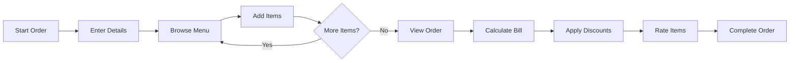

# 🍔 Krusty Krab: An Interactive Restaurant Management System

[](https://isocpp.org/)
[](LICENSE)
[](https://github.com)

A comprehensive C++ console-based restaurant management system that handles orders, billing, discounts, ratings, and generates detailed sales reports.

## 📋 Table of Contents

- [Features](#-features)
- [Menu](#-menu)
- [Technical Details](#-technical-details)
- [Usage](#-usage)
- [Screenshots](#-screenshots)
- [System Architecture](#-system-architecture)
- [Contributing](#-contributing)
- [License](#-license)

## ✨ Features

### 👥 Customer Features
- 🍽️ **Interactive Menu System** - Browse items across four categories
- 🛒 **Easy Ordering** - Add multiple items with custom quantities
- 📝 **Real-time Order Summary** - View your order before checkout
- 💰 **Smart Discounts**:
  - 5% discount on orders ≥ BDT 1000
  - 10% KUET student discount
- ⭐ **Rating System** - Rate items on a scale of 0-5 after purchase
- 🧾 **Automatic Billing** - VAT calculation (10%) and grand total computation

### 👨‍💼 Admin Features
- 📊 **Daily Sales Report** - Comprehensive breakdown of sales by category
- 💵 **Revenue Tracking** - Monitor total revenue and expenses
- 📈 **Item Performance** - Track units sold and revenue per item
- ⭐ **Customer Ratings** - View average ratings for all menu items
- 💹 **Profit Analysis** - Real-time profit/loss calculation

## 🍕 Menu

<table>
<tr>
<td valign="top" width="50%">

### 🥖 Starters
| Item | Price (BDT) |
|------|-------------|
| French Fries | 80 |
| Chicken Wings | 120 |
| Garlic Bread | 90 |
| Spring Rolls | 100 |

### 🍔 Main Course
| Item | Price (BDT) |
|------|-------------|
| Burger | 150 |
| Pizza | 200 |
| Pasta | 180 |
| Grilled Chicken | 220 |

</td>
<td valign="top" width="50%">

### 🥤 Drinks
| Item | Price (BDT) |
|------|-------------|
| Coca Cola | 50 |
| Fresh Juice | 70 |
| Coffee | 60 |
| Milkshake | 90 |

### 🍰 Desserts
| Item | Price (BDT) |
|------|-------------|
| Ice Cream | 80 |
| Chocolate Cake | 120 |
| Brownie | 100 |
| Pudding | 90 |

</td>
</tr>
</table>

## 🔧 Technical Details

### Object-Oriented Programming Concepts

The system demonstrates key OOP principles through **6 core classes**:

```cpp
MenuItem     // Manages individual menu items
Customer     // Stores customer information with validation
Order        // Handles order processing and tracking
Discount     // Calculates various discount schemes
Bill         // Manages billing and tax calculation
Rating       // Tracks and calculates item ratings
```

### 🎯 Operator Overloading

| Operator | Class | Purpose |
|----------|-------|---------|
| `*` | MenuItem | Multiplies item price by quantity |
| `-` | Bill | Applies discounts to bills |
| `>=` | Order | Checks if order meets discount threshold |
| `+` | Rating | Updates average ratings |
| `<<` | MenuItem, Customer | Formatted output |
| `>>` | Customer | Input validation |

### 🚀 Advanced Features
- ✅ Global tracking for revenue, expenses, and statistics
- ✅ Input validation (11-digit numeric phone numbers)
- ✅ Weighted average rating calculation
- ✅ Lambda functions for modular design
- ✅ Friend functions for operator overloading

## 📦 Installation

### Prerequisites
- C++ compiler with C++11 support or higher (GCC, Clang, MSVC)
- Standard C++ libraries

### Clone the Repository
```bash
git clone https://github.com/yourusername/krusty-krab-restaurant.git
cd krusty-krab-restaurant
```
## 💻 Usage

### Making an Order

1. Select **"1. Order Now!"** from the main menu
2. Enter your name and 11-digit phone number
3. Browse categories:
   - `1` - Starters
   - `2` - Main Course
   - `3` - Drinks
   - `4` - Desserts
   - `5` - View Order
   - `0` - Checkout
4. Add items with desired quantities
5. Apply available discounts
6. Rate your ordered items (0-5 stars)

### Viewing Sales Report (Admin)

1. Select **"2. Admin Section"** from the main menu
2. View comprehensive data:
   - 📦 Items sold by category
   - 💰 Revenue breakdown
   - 📊 Financial summary (profit/loss)
   - ⭐ Customer ratings and reviews

## 📸 Screenshots

### Main Menu
```
========== MAIN MENU ==========
1. Order Now!
2. Admin Section
3. Exit
===============================
```

### Order Summary
```
========== YOUR ORDER ==========
1. Burger x 2 - BDT 300
2. Pizza x 1 - BDT 200
3. Coffee x 1 - BDT 60
================================
Total Items in Order: 3
Total Amount: BDT 560
================================
```

### Bill with Discounts
```
========== BILL ==========
Subtotal:    BDT 560
VAT (10%):   BDT 56
-------------------------
Grand Total: BDT 616
==========================

--- Discount Section ---
Discount: 10% (KUET Student Discount) - BDT 61.6 off
Final Amount: BDT 554.4
```

## 🏗️ System Architecture

```
┌─────────────────────────────────────────┐
│           Main Program Loop             │
└─────────────────┬───────────────────────┘
                  │
        ┌─────────┴─────────┐
        │                   │
   ┌────▼────┐         ┌────▼────┐
   │ Customer│         │  Admin  │
   │  Module │         │  Module │
   └────┬────┘         └────┬────┘
        │                   │
   ┌────▼────────────┐      │
   │   Order Flow    │      │
   ├─────────────────┤      │
   │ • Customer Info │      │
   │ • Menu Selection│      │
   │ • Order Summary │      │
   │ • Billing       │      │
   │ • Discounts     │      │
   │ • Rating        │      │
   └─────────────────┘      │
                            │
                   ┌────────▼──────────┐
                   │   Sales Report    │
                   ├───────────────────┤
                   │ • Category Sales  │
                   │ • Revenue         │
                   │ • Profit/Loss     │
                   │ • Ratings Summary │
                   └───────────────────┘
```

## 📊 Sample Workflow



## 🔮 Future Enhancements

- [ ] Database integration (SQLite/MySQL)
- [ ] User authentication system
- [ ] Multiple payment methods
- [ ] Order history tracking
- [ ] Inventory management
- [ ] Employee management
- [ ] Table reservation system
- [ ] GUI implementation (Qt/wxWidgets)
- [ ] Multi-language support
- [ ] Receipt printing functionality

## 🤝 Contributing

Contributions are welcome! Please follow these steps:

1. Fork the repository
2. Create a feature branch (`git checkout -b feature/AmazingFeature`)
3. Commit your changes (`git commit -m 'Add some AmazingFeature'`)
4. Push to the branch (`git push origin feature/AmazingFeature`)
5. Open a Pull Request

## 📄 License

This project is licensed under the MIT License - see the [LICENSE](LICENSE) file for details.

## 👨‍💻 Author

**Your Name**
- GitHub: [@Was-iiiif](https://github.com/Was-iiiif)
- Email: wasifrahman121@gmail.com

## 🙏 Acknowledgments

- Inspired by real-world restaurant management systems
- Built as a demonstration of OOP concepts in C++

---

<div align="center">

**⭐ Star this repository if you found it helpful!**

Made with ❤️ using C++

</div>
